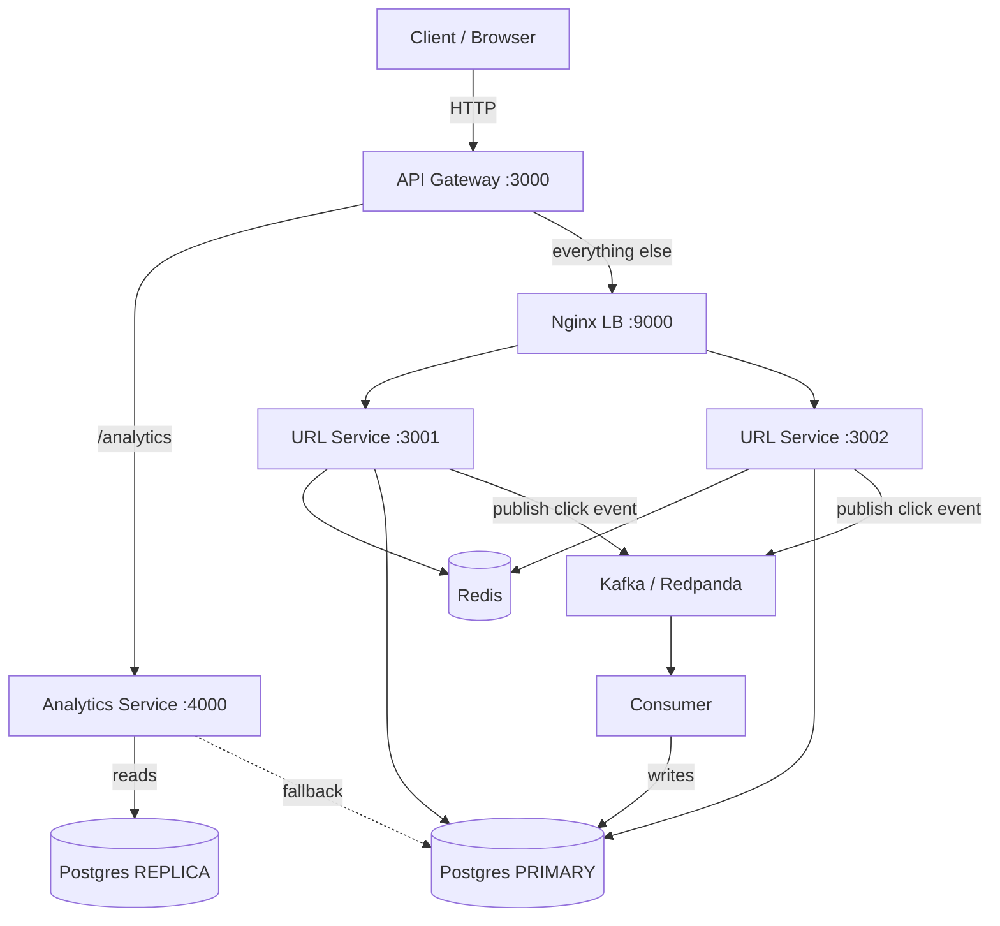
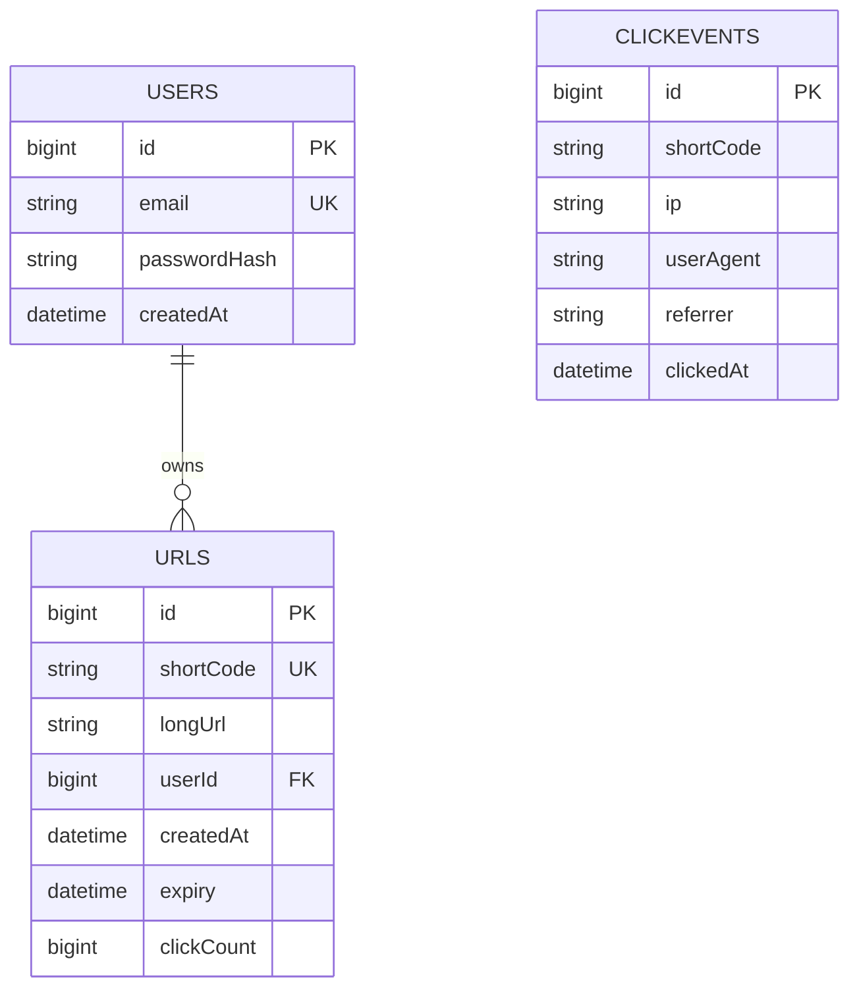

# Architecture — URL Shortener & Analytics Platform

## 1. System Overview

The URL Shortener & Analytics Platform converts long URLs into short, shareable
links and tracks how many times they are clicked. It is built as a learning-focused
system that demonstrates core system-design concepts: **caching**, **rate limiting**,
**async event processing**, and **horizontal scaling readiness**.

The platform is split into **independently runnable microservices** behind a single
public entry point:

- **`gateway/`** — API Gateway (port `3000`), the only public entry point. Routes
  requests by path to the internal services.
- **`services/url-service/`** — URL shortening, redirects, auth, Redis caching and
  rate limiting (the read-heavy hot path). Runs behind an Nginx load balancer across
  two instances (`3001`, `3002`).
- **`services/analytics-service/`** — click analytics queries (reads from the
  Postgres streaming replica, with fallback to the primary).
- **Consumer** (`services/analytics-service/consumer.js`) — a standalone Kafka
  process that ingests click events and writes them to the Postgres primary.

They share the Postgres schema (single `prisma/schema.prisma` at the repo root) and a
shared utilities package (`packages/shared/`), but own distinct data-access patterns
and scale independently. **Clients only ever talk to the Gateway**; internal services
are never addressed directly by clients.

Today the platform delivers:

- User registration and login (JWT-based authentication)
- Collision-free short code generation
- Duplicate URL detection (per user)
- Fast redirects backed by Redis (cache-aside)
- Click tracking via async Kafka events (read/write decoupling)
- Optional link expiry
- Per-user / per-IP rate limiting
- Click analytics (totals, clicks-over-time, top referrers, recent clicks)

## 2. Tech Stack

| Layer              | Technology                              | Purpose                                          |
| ------------------ | --------------------------------------- | ------------------------------------------------ |
| Runtime            | Node.js v24+                            | JavaScript execution environment                 |
| Web framework      | Express 5                               | HTTP routing, middleware pipeline                |
| API Gateway        | Express 5 + http-proxy-middleware       | Single public entry point, path-based proxying   |
| Load balancer      | Nginx                                   | Distributes URL Service traffic across instances |
| ORM / Data         | Prisma 7 + PostgreSQL (pg adapter)      | Type-safe database access, schema management     |
| Cache              | Redis (redis client 6)                  | URL cache + rate-limit counters                  |
| Event streaming    | Kafka / Redpanda (kafkajs)              | Fire-and-forget click-event publishing           |
| Auth               | JWT + bcrypt                            | Stateless session tokens, password hashing       |
| Validation         | Zod                                     | Request payload validation                       |
| Code generation    | nanoid                                  | Collision-free short code generation             |
| Shared utilities   | `@url-shorten/shared`                   | Kafka producer, Prisma factories, logger         |

**Language/module split:** `packages/shared` and `services/url-service` are
CommonJS; `gateway` and `services/analytics-service` are ES modules.

## 3. High-Level Architecture



```
Client
  │
  ▼
API Gateway (3000)
  ├──► Nginx LB (9000) ──► URL Service (3001, 3002) ──► Redis, Postgres Primary, Kafka (producer)
  └──► Analytics Service (4000) ──► Postgres Replica (w/ fallback to primary)
                                          ▲
                                          │
                                  Consumer ──► Kafka (consumer), Postgres Primary
```

### Routing rules (Gateway)

| Incoming path            | Downstream                                             |
| ------------------------ | ------------------------------------------------------ |
| `/analytics/*`           | Analytics Service (`ANALYTICS_SERVICE_URL`, :4000)     |
| `/health`                | URL Service via Nginx LB                               |
| `/signup`, `/login`, `/me` | URL Service via Nginx LB                             |
| `/shorten`               | URL Service via Nginx LB                               |
| `/` (catch-all)          | URL Service via Nginx LB — short codes + frontend assets |

The gateway uses `legacyCreateProxyMiddleware`. In http-proxy-middleware's legacy
mode, Express's mount-path stripping is reverted (`req.url = req.originalUrl`), so
the **full original path** (e.g. `/analytics/QjY7qMi`) is forwarded to the
downstream service. Routes are registered most-specific-first so the catch-all `/`
does not swallow `/analytics`, `/signup`, etc.

### Proxy / IP chain

Requests to the URL Service traverse two proxies: the **gateway** (sets
`X-Forwarded-For` via `xfwd: true`) and **Nginx** (appends the gateway hop via
`$proxy_add_x_forwarded_for`). URL Service runs with `app.set("trust proxy", 2)` so
`req.ip` resolves to the real client address — keeping rate-limit buckets and
recorded click IPs per-client. Nginx also fails over with
`proxy_next_upstream error timeout http_502 http_503 http_504` and returns a JSON
`502 {"error":"URL Service is currently unavailable"}` when the whole pool is down.

## 4. Request Lifecycle

### 4.1 Shorten (`POST /shorten`)

1. Client → **Gateway** (`:3000`), which proxies to **Nginx** (`:9000`).
2. **Nginx** load-balances to a **URL Service** instance (`:3001`/`:3002`).
3. `optionalAuth` resolves `req.userId` from `Authorization: Bearer <token>` if present.
4. `rateLimit("shorten")` increments a Redis counter; rejects with **429** when exceeded.
5. Zod validates the payload (valid `http://`/`https://` URL, max 2048 chars).
6. The handler checks for an existing URL for the same `(longUrl, userId)` pair —
   if found, returns **200** with the existing record (duplicate detection).
7. Otherwise a new 7-character nanoid short code is persisted; returns **201**.

### 4.2 Redirect (`GET /:code`)

1. Client → **Gateway** → **Nginx** → **URL Service**.
2. Look up `shortCode:<code>` in **Redis**.
3. **Cache hit** → publish a click event to **Kafka** (fire-and-forget) and
   **302 redirect** immediately to the cached long URL.
4. **Cache miss** → query **Postgres PRIMARY**. On success:
   - If the link has expired, return **410 Gone**.
   - Populate Redis with a 1-hour TTL, publish the click event, and redirect.
   - If no record exists, return **404**.

The redirect path is **read-only** — it never writes to PostgreSQL. Every click is
published to the `link-clicked` topic and consumed asynchronously by the consumer,
decoupling the latency-sensitive read path from the write-heavy analytics path.

### 4.3 Authentication (`POST /signup`, `POST /login`)

1. Client → **Gateway** → **Nginx** → **URL Service**.
2. `rateLimit("auth", { limit: 10, window: 60 })` guards both endpoints per IP.
3. **Signup:** validate, reject duplicate emails (`409`), bcrypt-hash the password,
   persist, and return `{ id, email }`.
4. **Login:** check the per-email failure throttle, verify credentials with
   `bcrypt.compare` (constant-time even for unknown emails via a dummy hash), then
   sign and return a JWT (configured via `JWT_EXPIRES_IN`, default 1 hour).

### 4.4 Analytics read (`GET /analytics/:code`)

1. Client → **Gateway**, which routes to the **Analytics Service** (`:4000`).
2. `auth` verifies the JWT; `userId` is resolved.
3. The service health-checks the **Postgres replica** (`SELECT 1`) and uses it, or
   transparently falls back to the **primary** if the replica is unavailable.
4. Object-level authorization: owned links are visible only to the owner; anonymous
   links (no owner) are viewable by any authenticated user.
5. Returns `{ shortCode, totalClicks, clickOverTime, topReferrers, recentClicks }`.

### 4.5 Click ingestion (Consumer)

1. URL Service publishes `{ shortCode, timestamp, ip, userAgent, referrer }` to
   `link-clicked`.
2. The **consumer** (`analytics-consumer-group`) reads from its last committed offset.
3. It validates the `shortCode` exists, sanitizes attacker-controlled headers
   (strips control chars, caps lengths), then runs a transaction on the **primary**:
   insert a `click_events` row and increment `urls.clickCount`.
4. Killing the consumer mid-traffic loses no data — Kafka retains messages until it
   resumes and catches up.

## 5. Components

| Component                    | File                                                    | Responsibility                                        |
| ---------------------------- | ------------------------------------------------------- | ----------------------------------------------------- |
| API Gateway                  | `gateway/app.js`                                        | Public entry point, path-based proxying, 503 handler  |
| Nginx load balancer          | `nginx.conf`                                            | Balance URL Service traffic across 3001/3002          |
| URL Service entry point      | `services/url-service/app.js`                           | Middleware wiring, Redis/Kafka connect, listen        |
| URL Service config           | `services/url-service/config.js`                        | Centralized env config + required-var validation      |
| Redis client                 | `services/url-service/redis.js`                         | Redis connection from environment variables           |
| Auth routes                  | `services/url-service/routes/auth.routes.js`            | `/signup`, `/login`                                   |
| URL routes                   | `services/url-service/routes/url.routes.js`             | `/shorten`, `/:code`, `/me/urls`                      |
| Health route                 | `services/url-service/routes/health.routes.js`          | `/health` (primary connectivity)                      |
| Auth middleware              | `services/url-service/middleware/auth.js`               | JWT verification (`auth` + `optionalAuth`)            |
| Rate-limit middleware        | `services/url-service/middleware/rateLimit.js`          | Redis fixed-window rate limiting                      |
| Validation schemas           | `services/url-service/schemas/*.js`                     | Zod schemas for auth and URL payloads                 |
| URL service logic            | `services/url-service/services/url.service.js`          | Shorten/redirect/cache/Kafka logic                    |
| Auth service logic           | `services/url-service/services/auth.service.js`         | Signup/login, bcrypt, JWT, failure throttle           |
| Frontend                     | `services/url-service/public/*`                         | Vanilla JS UI — shorten, auth, analytics checker      |
| Analytics Service entry      | `services/analytics-service/app.js`                     | Express app for `/analytics` + `/health`              |
| Analytics route              | `services/analytics-service/routes/analytics.routes.js` | `GET /analytics/:code`, `GET /health`                 |
| Analytics auth middleware    | `services/analytics-service/middleware/auth.js`         | JWT verification                                      |
| Analytics query logic        | `services/analytics-service/services/analytics.service.js` | Replica reads w/ primary fallback, aggregations    |
| Click consumer process       | `services/analytics-service/consumer.js`                | Kafka consumer loop                                   |
| Click processing             | `services/analytics-service/services/consumer.service.js` | Sanitize + transaction: insert event, bump clickCount |
| Shared Kafka producer        | `packages/shared/kafka.js`                              | Producer with reconnect + fail-open send              |
| Shared Prisma factories      | `packages/shared/db.js`                                 | Primary/replica `PrismaClient` via pg adapter         |
| Shared logger                | `packages/shared/logger.js`                             | Leveled logging                                       |
| Prisma schema / migrations   | `prisma/`                                               | Data model + SQL migration history                    |
| Postgres init / replication  | `docker/`                                               | Primary config + replica bootstrap (`pg_basebackup`)  |

## 6. Data Model



A single shared schema lives at [`prisma/schema.prisma`](./prisma/schema.prisma).
Both services generate/use the Prisma client from it but work with different
tables/access patterns.

### `users`

| Column         | Type      | Notes                                  |
| -------------- | --------- | -------------------------------------- |
| `id`           | BigInt    | Auto-increment primary key             |
| `email`        | String    | Unique, used for login                 |
| `passwordHash` | String    | bcrypt hash (never stored plain)       |
| `createdAt`    | DateTime  | Defaults to now                        |

### `urls`

| Column       | Type      | Notes                                          |
| ------------ | --------- | ---------------------------------------------- |
| `id`         | BigInt    | Auto-increment primary key                     |
| `shortCode`  | String    | Unique 7-char nanoid, used in redirects        |
| `longUrl`    | String    | The destination URL                            |
| `userId`     | BigInt?   | Nullable FK → `users.id` (`ON DELETE SET NULL`) |
| `createdAt`  | DateTime  | Defaults to now                                |
| `expiry`     | DateTime? | Nullable; expired links return **410**         |
| `clickCount` | BigInt    | Denormalized counter, incremented by consumer  |

### `click_events`

| Column       | Type      | Notes                                    |
| ------------ | --------- | ---------------------------------------- |
| `id`         | BigInt    | Auto-increment primary key               |
| `shortCode`  | String    | Indexed; the shortened code that was hit |
| `ip`         | String?   | Clicker IP address (from the event)      |
| `userAgent`  | String?   | Clicker User-Agent (from the event)      |
| `referrer`   | String?   | HTTP referrer (from the event)           |
| `clickedAt`  | DateTime  | Event timestamp; defaults to now         |

## 7. Caching Strategy

- **Pattern:** Cache-aside (lazy population). The cache is checked first; on a
  miss the database is read and the cache populated.
- **Key:** `shortCode:<code>` → long URL string.
- **TTL:** 1 hour (`EX: 3600`).
- **Click tracking:** every redirect publishes a fire-and-forget event to Kafka
  (`link-clicked`). The standalone consumer inserts the event into `click_events`
  and increments `clickCount` asynchronously. The redirect path performs **no DB
  write**, so it is never blocked by analytics writes.
- **Impact:** repeated redirects of popular links are served from memory without
  touching PostgreSQL.

## 8. Rate Limiting Strategy

- **Mechanism:** Redis `INCR` + `EXPIRE` (fixed window).
- **Scopes:**

  | Endpoint              | Limit          | Key            |
  | --------------------- | -------------- | -------------- |
  | `POST /shorten`       | 5 / 60s        | `userId` else `ip` |
  | `POST /signup`        | 10 / 60s       | `ip`           |
  | `POST /login`         | 10 / 60s       | `ip`           |
  | Failed login attempts | 10 / 60s       | `email`        |

- **Response:** **429** with the remaining retry wait (TTL) in seconds.
- **Resilience:** if Redis fails during limiting, the request passes through
  (fail-open) to avoid taking down the service.

## 9. Security

- **Passwords** are hashed with bcrypt (cost factor 10); plaintext is never stored.
- **Sessions** use signed JWTs verified on every protected request.
- **User enumeration** is mitigated by identical login errors and a dummy bcrypt
  comparison for unknown emails (constant response time).
- **Object-level authorization:** analytics for an owned link are only visible to
  the owner; anonymous links stay readable by any authenticated user.
- **Open-redirect protection** via URL scheme whitelisting (`http://` / `https://`),
  enforced at creation and re-checked before redirect (defense in depth).
- **Input sanitization:** attacker-controlled headers (User-Agent, Referer, IP) are
  stripped of control characters and length-capped before storage.
- **SQL injection:** Prisma parameterizes queries; the raw analytics query uses a
  tagged-template `$queryRaw` (auto-parameterized).
- **Global error handling** returns generic **500** responses and a **404** for
  unknown routes, avoiding internal detail leakage.

### Local-only exposures (never deploy as-is)

The topology diagram says "Clients only ever talk to the Gateway" — that is a
**routing contract, not a network boundary**. In the local setup every port is
published and reachable directly:

- Nginx LB :9000 — a client could bypass the gateway and hit the URL Service pool.
- URL Service :3001/:3002 — run on the host, directly reachable.
- Postgres :5432/:5433, Redis :6379, Redpanda (Kafka) :9092 — published by
  docker-compose.

Consequence of the gateway bypass: `trust proxy: 2` (dependency in §3) trusts the
Nginx and gateway hops to resolve `req.ip`. A client that hits Nginx :9000 directly
with a forged `X-Forwarded-For` can therefore spoof the client IP that drives
**rate-limit buckets and recorded click IPs**. This is acceptable for local
development and load testing, but any deployment must keep the gateway on the edge
(Nginx, url-service, database, Redis, and Kafka on private networks only) before
treating the trust-proxy chain as a security boundary. The same caveat applies to
the `pg_hba.conf` `trust` auth and wide-open CORS described in the README.

## 10. Project Structure

```
URL-Shorten/
├── package.json                    # Root workspaces + dev scripts
├── .env.example                    # Consolidated env template
├── docker-compose.yml              # Redis + Nginx + Redpanda + Postgres primary/replica
├── nginx.conf                      # URL Service upstream (3001/3002)
├── load-test.js                    # k6 load test
├── prisma.config.ts                # Prisma CLI configuration
├── prisma/
│   ├── schema.prisma               # Shared data model (single source of truth)
│   └── migrations/                 # SQL migration history
│
├── docker/
│   ├── primary-init/               # Postgres primary entrypoint scripts + pg_hba.conf
│   └── replica-init/               # Postgres replica bootstrap (pg_basebackup)
│
├── packages/
│   └── shared/                     # Shared utilities package (@url-shorten/shared)
│       ├── kafka.js                # Kafka producer — connect/send/reconnect
│       ├── db.js                   # Prisma primary + replica factories (pg adapter)
│       ├── logger.js               # Centralized logging
│       └── index.js                # Barrel re-export
│
├── services/
│   ├── url-service/                # URL Service — port 3001 (second instance 3002)
│   │   ├── app.js                  # Entry point — middleware wiring, Redis/Kafka connect
│   │   ├── config.js               # Centralized env config + validation
│   │   ├── redis.js                # Redis client
│   │   ├── routes/
│   │   │   ├── auth.routes.js      # /signup, /login
│   │   │   ├── url.routes.js       # /shorten, /:code, /me/urls
│   │   │   └── health.routes.js    # /health
│   │   ├── middleware/
│   │   │   ├── auth.js             # JWT verification (auth + optionalAuth)
│   │   │   └── rateLimit.js        # Redis fixed-window rate limiter
│   │   ├── services/
│   │   │   ├── auth.service.js     # Auth business logic
│   │   │   └── url.service.js      # URL business logic
│   │   ├── schemas/                # Zod validation schemas
│   │   ├── public/                 # Frontend (index.html, style.css, app.js)
│   │   └── package.json
│   │
│   └── analytics-service/          # Analytics Service — port 4000 + consumer
│       ├── app.js                  # Entry point — Express app for /analytics
│       ├── consumer.js             # Kafka consumer process
│       ├── routes/
│       │   └── analytics.routes.js # GET /analytics/:code, /health
│       ├── middleware/
│       │   └── auth.js             # JWT verification
│       ├── services/
│       │   ├── analytics.service.js # Analytics query logic (replica + fallback)
│       │   └── consumer.service.js  # Click event processing
│       └── package.json
│
├── gateway/                        # API Gateway — public entry point, port 3000
│   ├── app.js                      # Path-based proxying to url-service + analytics-service
│   └── package.json                # Express + http-proxy-middleware
│
├── generated/prisma/              # Shared generated Prisma client (gitignored)
└── docs/                          # Postman collection
```

## 11. Future Roadmap

- **Analytics dashboard** — clicks over time, referrers, geolocation.
- **Custom short codes / link expiry management** — user-facing controls.
- **Dead-letter queue** for failed consumer events.
- **Fully standalone deployment** — per-service Prisma client, no shared generated
  client.
