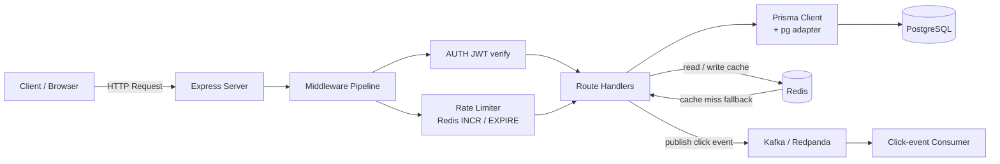
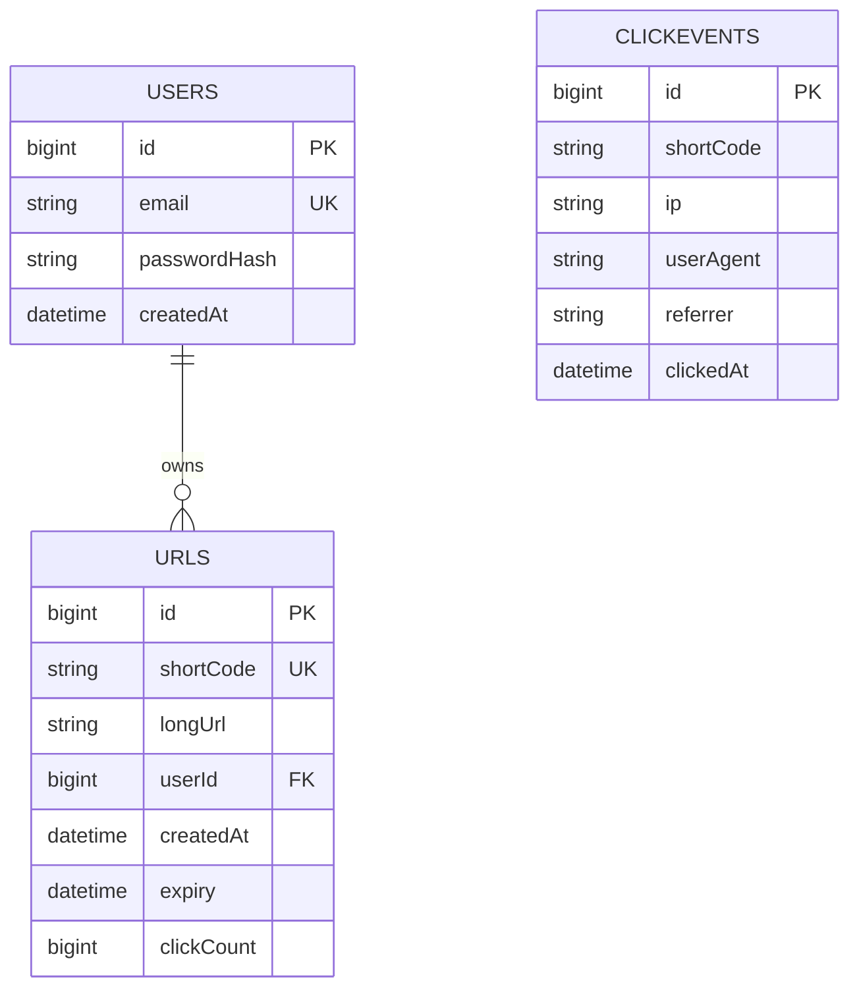

# Architecture — URL Shortener & Analytics Platform

## 1. System Overview

The URL Shortener & Analytics Platform is a backend service that converts long URLs
into short, shareable links and tracks how many times they are clicked. It is built
as a learning-focused system that demonstrates core system-design concepts:
**caching**, **horizontal scaling readiness**, and **rate limiting**.

Today the platform delivers:

- User registration and login (JWT-based authentication)
- Collision-free short code generation
- Duplicate URL detection (per user)
- Fast redirects backed by an in-memory distributed cache (Redis)
- Click tracking via async Kafka events (read/write decoupling)
- Optional link expiry
- Per-user / per-IP rate limiting on shortening

## 2. Tech Stack

| Layer            | Technology                          | Purpose                                        |
| ---------------- | ----------------------------------- | ---------------------------------------------- |
| Runtime          | Node.js (CommonJS)                  | JavaScript execution environment               |
| Web framework    | Express 5                           | HTTP routing, middleware pipeline              |
| ORM / Data       | Prisma 7 + PostgreSQL (pg adapter)  | Type-safe database access, schema management   |
| Cache            | Redis (redis client 6)          | URL cache + rate-limit counters                |
| Event streaming   | Kafka/Redpanda (kafkajs)        | Fire-and-forget click-event publishing         |
| Auth             | JWT + bcrypt                    | Stateless session tokens, password hashing     |
| Validation       | Zod                                 | Request payload validation                     |
| Code generation  | nanoid                              | Collision-free short code generation           |

## 3. High-Level Architecture



```
                    ┌──────────────────────────────────────┐
                    │              Client                   │
                    └──────────────────┬───────────────────┘
                                       │  HTTP
                    ┌──────────────────▼───────────────────┐
                    │            Express (app.js)           │
                    │  JSON body parsing · 404 · error      │
                    └──────────────────┬───────────────────┘
                                       │
                    ┌──────────────────▼───────────────────┐
                    │         Middleware Pipeline           │
                    │  Auth (JWT) · Rate Limit (Redis)     │
                    └──────────────────┬───────────────────┘
                                       │
                    ┌──────────────────▼───────────────────┐
                    │         Route Handlers               │
                    │  /signup · /login · /health          │
                    │  /shorten · /:code (redirect)        │
                    └───┬──────────────┬───────────────────┘
                        │              │
              ┌─────────▼──────┐  ┌────▼──────────────┐
              │ Prisma + pg    │  │   Redis           │
              │ PostgreSQL     │  │  URL cache        │
              │ (source of     │  │  rate counters    │
              │  truth)        │  └───────────────────┘
              └────────────────┘
                        │ publish click event
              ┌─────────▼──────────────────────────┐
              │  Kafka / Redpanda (link-clicked)   │
              │  fire-and-forget, no DB write      │
              └─────────┬──────────────────────────┘
                        │
              ┌─────────▼──────────────────────────┐
              │  Click-event consumer (async)      │
              └────────────────────────────────────┘
```

## 4. Request Lifecycle

### 4.1 Shorten (`POST /shorten`)

1. JWT `auth` middleware resolves `req.userId` from the `Authorization: Bearer <token>` header.
2. `rateLimit("shorten")` middleware increments a Redis counter; rejects with
   **429** if the limit is exceeded.
3. Zod validates the payload (must be a valid `http://` / `https://` URL, max 2048 chars).
4. The handler checks for an existing URL for the same `(longUrl, userId)` pair —
   if found, returns **200** with the existing record (duplicate detection).
5. Otherwise a new 7-character nanoid short code is generated and the record is
   persisted; returns **201**.

### 4.2 Redirect (`GET /:code`)

1. Look up `shortCode:<code>` in Redis.
2. **Cache hit** → publish a click event to Kafka (fire-and-forget) and
   **302 redirect** immediately to the cached long URL.
3. **Cache miss** → query PostgreSQL. On success:
   - If the link has expired, return **410 Gone**.
   - Populate Redis with a 1-hour TTL, publish the click event, and redirect.
   - If no record exists, return **404**.

The redirect path is **read-only** — it never writes to PostgreSQL. Every click is
published to the `link-clicked` topic and consumed asynchronously by a standalone
consumer that inserts an analytics row (`click_events`) and increments
`clickCount`, decoupling the latency-sensitive read path from the write-heavy
analytics path.

### 4.3 Authentication (`POST /signup`, `POST /login`)

- Signup: validate, reject duplicate emails, bcrypt-hash the password, persist,
  and return the user (id + email).
- Login: verify credentials with `bcrypt.compare`, then sign and return a JWT
  (currently hard-coded to 1-hour expiry in code).

## 5. Components

| Component                    | File                                | Responsibility                                        |
| ---------------------------- | ----------------------------------- | ----------------------------------------------------- |
| Entry point                  | `app.js`                            | Config load, middleware wiring, Redis connect, listen |
| Auth routes                  | `routes/auth.routes.js`             | Signup / login endpoints                              |
| URL routes                   | `routes/url.routes.js`              | Health, shorten, redirect endpoints                   |
| Auth middleware              | `middleware/auth.middleware.js`     | JWT verification → `req.userId`                       |
| Rate-limit middleware        | `middleware/rateLimit.middleware.js`| Redis-based fixed-window rate limiting                |
| Validation schemas           | `schemas/*.js`                      | Zod schemas for auth and URL payloads                 |
| Prisma client                | `lib/prisma.js`                     | PrismaClient with PostgreSQL driver adapter           |
| Redis client                 | `config/redis.js`                   | Redis connection from environment variables           |
| Kafka client / producer      | `kafka.js`                          | Kafka connection, producer for `link-clicked`        |
| Click-event consumer         | `consumer.js`                       | Inserts `click_events` row + increments `clickCount` |
| Serialization helper         | `utils/serialize.js`                | BigInt-safe JSON serialization                        |
| Prisma schema / migrations   | `prisma/`                           | Data model + SQL migration history                    |

## 6. Data Model



### `users`

| Column        | Type      | Notes                                  |
| ------------- | --------- | -------------------------------------- |
| `id`          | BigInt    | Auto-increment primary key             |
| `email`       | String    | Unique, used for login                 |
| `passwordHash`| String    | bcrypt hash (never stored plain)       |
| `createdAt`   | DateTime  | Defaults to now                        |

### `urls`

| Column       | Type     | Notes                                     |
| ------------ | -------- | ----------------------------------------- |
| `id`         | BigInt   | Auto-increment primary key                |
| `shortCode`  | String   | Unique 7-char nanoid, used in redirects   |
| `longUrl`    | String   | The destination URL                       |
| `userId`     | BigInt?  | Nullable FK → `users.id` (`ON DELETE SET NULL`) |
| `createdAt`  | DateTime | Defaults to now                           |
| `expiry`     | DateTime?| Nullable; expired links return **410**    |
| `clickCount` | BigInt   | Denormalized counter, incremented by the consumer |

### `click_events`

| Column      | Type     | Notes                                    |
| ----------- | -------- | ---------------------------------------- |
| `id`        | BigInt   | Auto-increment primary key               |
| `shortCode` | String   | Indexed; the shortened code that was hit |
| `ip`        | String?  | Clicker IP address (from the event)      |
| `userAgent` | String?  | Clicker User-Agent (from the event)      |
| `referrer`  | String?  | HTTP referrer (from the event)           |
| `clickedAt` | DateTime | Event timestamp; defaults to now         |

## 7. Caching Strategy

- **Pattern:** Cache-aside (lazy population). The cache is checked first; on a
  miss the database is read and the cache populated.
- **Key:** `shortCode:<code>` → long URL string.
- **TTL:** 1 hour (`EX: 3600`).
- **Click tracking:** every redirect publishes a fire-and-forget event to Kafka
  (`link-clicked`) with `shortCode`, `timestamp`, `ip`, `userAgent`, `referrer`.
  A standalone consumer (`consumer.js`) inserts the event into `click_events` and
  increments `clickCount` asynchronously. The redirect path performs **no DB
  write**, so it is not blocked by analytics writes; the write is decoupled to
  an asynchronous consumer.
- **Impact:** repeated redirects of popular links are served from memory without
  touching PostgreSQL.

## 8. Rate Limiting Strategy

- **Mechanism:** Redis `INCR` + `EXPIRE` (fixed window).
- **Limit:** 5 requests per 60-second window.
- **Scope:** applied to `POST /shorten`; keyed by `userId` when authenticated,
  otherwise by IP address.
- **Response:** **429** with the remaining retry wait (TTL) in seconds.
- **Resilience:** if Redis fails during limiting, the request passes through
  (fail-open) to avoid taking down the service.

## 9. Security

- **Passwords** are hashed with bcrypt (cost factor 10); plaintext is never stored.
- **Sessions** use signed JWTs verified on every protected request.
- **Open-redirect protection** via URL scheme whitelisting (`http://` / `https://`).
- **Rate limiting** mitigates abusive short-link creation.
- **Global error handling** returns generic **500** responses and a **404** for
  unknown routes, avoiding internal detail leakage.

## 10. Project Structure

```
url-shorten-b/
├── app.js                       # Entry point & middleware wiring
├── prisma.config.ts             # Prisma CLI configuration
├── prisma/
│   ├── schema.prisma            # Data model
│   └── migrations/              # SQL migration history
├── routes/
│   ├── auth.routes.js           # /signup, /login
│   └── url.routes.js            # /health, /shorten, /:code
├── middleware/
│   ├── auth.middleware.js       # JWT verification
│   └── rateLimit.middleware.js  # Redis fixed-window limiter
├── schemas/
│   ├── auth.schema.js           # Zod: signup / login
│   └── url.schema.js            # Zod: shorten
├── config/
│   └── redis.js                 # Redis client
├── lib/
│   └── prisma.js                # Prisma client (pg adapter)
├── utils/
│   └── serialize.js             # BigInt-safe serialization
├── kafka.js                     # Kafka client + producer
├── consumer.js                  # Standalone consumer: ClickEvent insert + clickCount write-back
└── generated/prisma/            # Generated Prisma client (gitignored)
```

## 11. Future Roadmap

- **Analytics dashboard** — clicks over time, referrers, geolocation.
- **Read replication** — offload reads to replicas for horizontal scaling.
- **Multiple app instances** — Redis already provides shared cache + rate
  counters, ready for stateless horizontal scaling.
- **Custom short codes / link expiry management** — user-facing controls.
